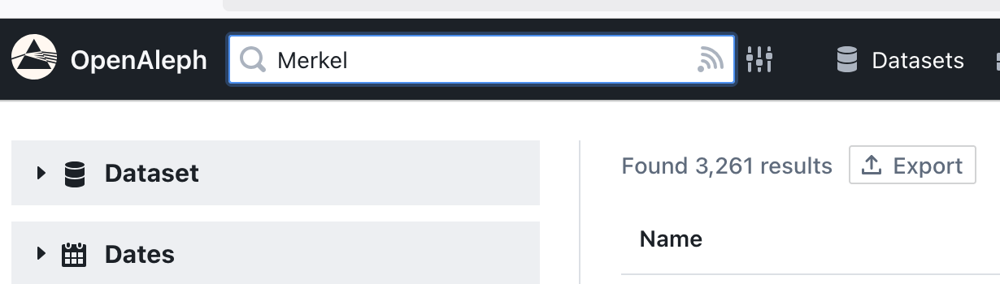
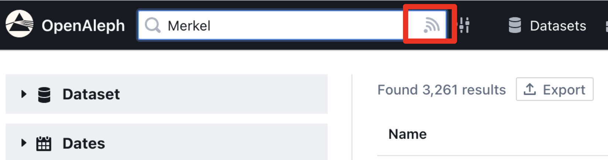
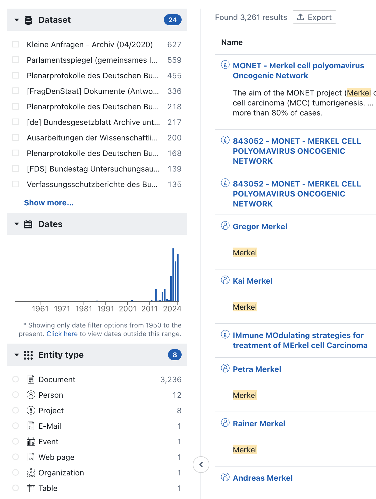
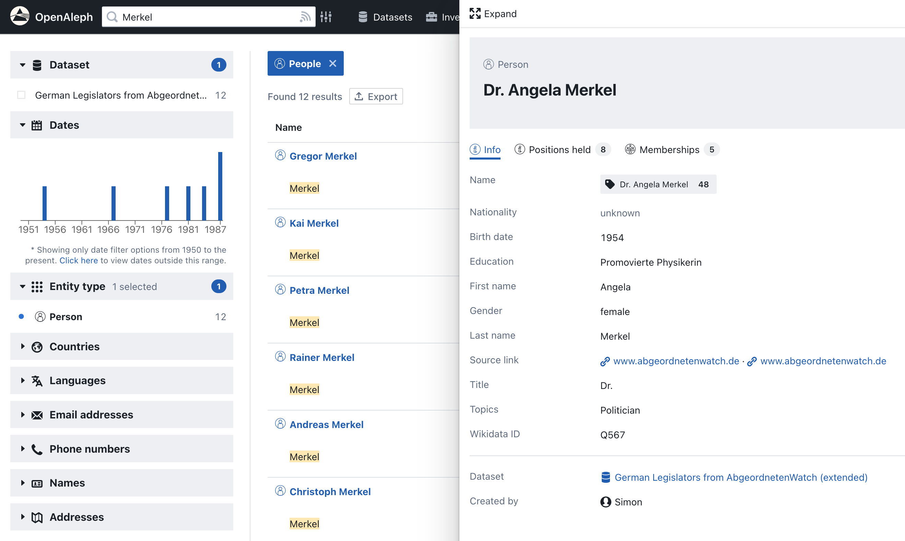

# Basic Search

Search is at the core of OpenAleph. From the homepage or the top navigation bar, you can run searches across all collections and datasets you have access to.

This guide walks you through the basics of running a search and understanding the results.

  

    <iframe src="https://www.youtube-nocookie.com/embed/lh-KJvz4xtE?si=mgci65CRm-7FnXfW" frameborder="0" allowfullscreen
      style="position:absolute;top:0;left:0;width:100%;height:100%;"></iframe>
  

## 1. Performing a Search
At the top of every page is the global search bar. To perform a basic search, type a keyword, such as a name, company, or location and press `Enter`.

{style="width:600px; margin:auto; display:block"}

This will show you matching entities, such as Documents, Persons, Companies, or other relevant types.

## 2. Setting Alerts
Click the `alerts icon` to the right of the search bar to receive email notifications whenever new data added mentions this search.

{style="width:600px; margin:auto; display:block"}

## 3. Understanding the Results

The search results page is split into several sections:

**Filter Sidebar**

{style="width:600px; margin:auto; display:block"}

On the left, you’ll find filters you can apply to narrow your results by dataset, date, schema type, or other criteria.

**Results List**

{style="width:800px; margin:auto; display:block"}

In the main area, results are grouped by relevance. Each item shows a title, snippet of matched content, and metadata.

## 4. Previewing a Result

{style="width:800px; margin:auto; display:block"}

Click on any document or entity to open its preview pane:

- For documents: you'll see the extracted text, metadata, and any linked entities.
- For entities: you’ll see structured data fields like name, type, jurisdiction, and connections.

You can expand the entity by clicking the `Expand` button on top of the preview pane.

---

Once you’re comfortable with basic searches, the next step is to refine your results using filters and explore more advanced search techniques. Head to the [advanced searches and dataset navigation section](../102/index.md) to continue.
