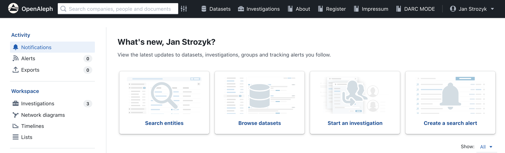
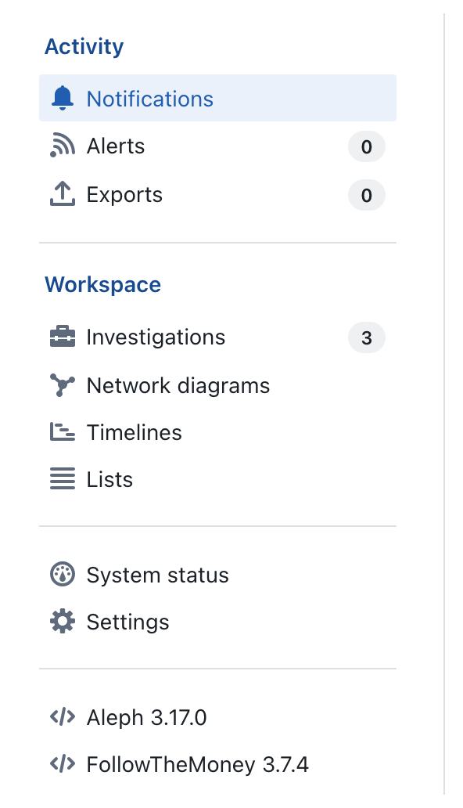

# Navigating the OpenAleph Homepage

Upon logging into OpenAleph, you're presented with the homepage—a central hub for accessing datasets, managing investigations, and utilizing various tools. This guide provides an overview of the homepage's main components to help you navigate efficiently.

## Top Menu

The top menu offers quick access to key features:

- **Search Box**: This allows you to perform searches across all datasets and investigations you have access to. For advanced search options, click the gray symbol adjacent to the search box.

- **Datasets**: Click here to view all datasets available to your account.

- **Investigations**: Access your personal investigation workspaces. Here, you can upload documents, cross-reference data, and build relationship diagrams. By default, these workspaces are private but can be shared with other OpenAleph users. If a user shares an investigation with you, it will also show up here.

- **About**: Learn more about the OpenAleph project, including terms of use and frequently asked questions.

- **Account Settings**: Click your profile name in the upper right corner to access notifications, alerts, exports, investigations, network diagrams, timelines, lists, settings, system status, and the option to sign out.

## Side Menu

The side menu provides additional navigation options:

### Activity

- **Notifications**: Displays updates to datasets accessible to you.

- **Alerts**: Manage alerts for specific terms. OpenAleph can notify you via email when new data matching your criteria is added.

- **Exports**: Access and manage the results of your searches that you've chosen to download.

### Workspace

- **Investigations**: Summarizes the number of investigation workspaces you've created.

- **Network Diagrams**: Visualize connections between entities like people, companies, and bank accounts.

- **Timelines**: Create visual representations of events over time.

- **Lists**: Organize and group related entities of interest.

### Groups

Displays the research projects or groups that you've been granted access to within OpenAleph.

---

Understanding the layout and features of the OpenAleph homepage will enhance your ability to navigate the platform and utilize its tools effectively.
