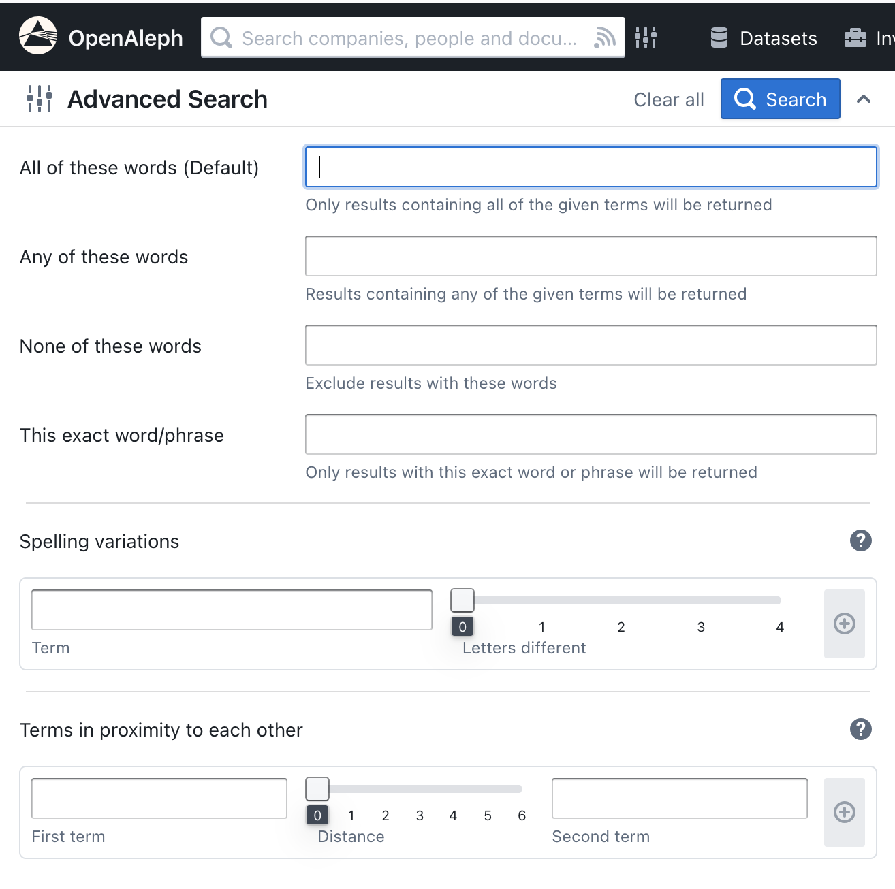

# Advanced Search

OpenAleph’s advanced search capabilities let you perform more precise and complex queries. This guide covers various advanced search techniques, including exact phrase searches, spelling variations, proximity searches, logical operators, and property-based filtering.

Most of the options below can be accessed and configured through the advanced search menu, available via the grey slider icon next to the main search bar. Note that property searches cannot currently be configured through the user interface.

{style="width:600px; margin:auto; display:block"}

## Exact Phrase Search

To search for an exact phrase, enclose the phrase in double quotes:

```
"Vladimir Putin"
```

This query returns results containing the exact phrase "Vladimir Putin". OpenAleph also applies normalization, so it will match transliterated versions like "Владимир Путин".

## Spelling Variations

Use the tilde `~` operator to search for terms with similar spellings. For example:

```
Putin~2
```

This returns results that include "Putin" and terms with up to two character differences, such as "Poutin" or "Putan".

## Proximity Search

To find terms that appear within a certain number of words from each other, use the tilde `~` operator followed by a number:

```
"Trump Putin"~10
```

This finds instances where "Trump" and "Putin" appear within 10 words of each other.

## Logical Operators

Combine search terms using logical operators:

- **AND**: Both terms must be present.
  ```
  Trump AND Putin
  ```
- **OR**: Either term can be present.
  ```
  Trump OR Putin
  ```
- **NOT**: Exclude terms.
  ```
  Trump NOT Putin
  ```
- **Grouping**: Use parentheses to group terms.
  ```
  (Trump OR Biden) AND (Russia OR Ukraine)
  ```

## Combining Multiple Filters

You can combine multiple filters for complex queries:

```
+Trump AND (Salman OR Putin) -South Korea
```

This query returns results that must include "Trump", must include either "Salman" or "Putin", and must not include "South Korea".

## Property-Based Filtering

Filter search results based on specific entity properties using the `properties.` prefix.

### Email Property

To find entities with a specific email address:

```
properties.email:john.doe@example.org
```

For approximate matches:

```
properties.email:john.doe@example.org~1
```

Using regular expressions:

```
properties.email:/john.?doe@example.org/
```

*A note on regular expressions: these searches consume a lot of ressources and can slow the system down. Please use them with caution.*

### Date Properties

Filter entities based on date properties:

- Greater than a specific date:
  ```
  properties.incorporationDate:>2010-07-01
  ```
- Between two dates:
  ```
  properties.incorporationDate:[2010-01-01 TO 2015-12-31]
  ```

### Numeric Properties

For numeric properties, use the `numeric.` prefix:

```
numeric.rowCount:>99
```

This returns entities where the `rowCount` property is greater than 99.

## Schema and Dataset Filtering

### Schema Filtering

To filter entities by schema:

- Exact schema:
  ```
  schema:LegalEntity
  ```
- Schema and its descendants:
  ```
  schemata:LegalEntity
  ```

### Dataset Filtering

To filter results from a specific dataset or investigation, use the `collection_id` filter:

```
collection_id:123
```

Replace `123` with the actual dataset or investigation ID. You can find it in the direct link, which will look similar to this: `search.openaleph.org/datasets/123` or `search.openaleph.org/investigations/123`

---

By mastering these advanced search techniques, you’ll be able to navigate OpenAleph’s extensive datasets more efficiently and extract the information you need.
