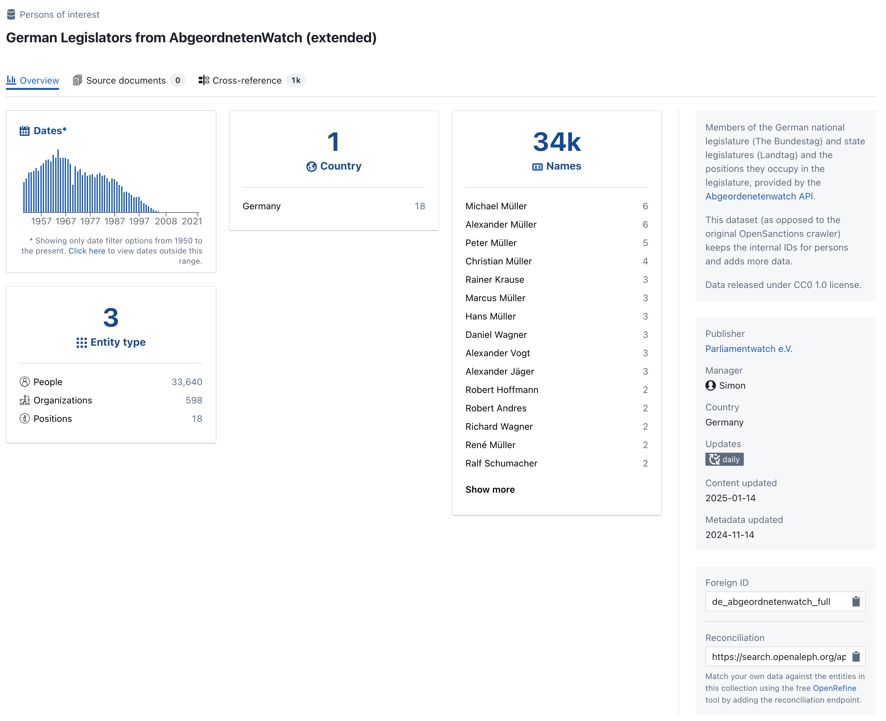

# Dataset Overview

Datasets are central to how OpenAleph organizes and structures information. Each dataset represents a collection of documents or structured data that has been uploaded or ingested into the system.

## What is a Dataset?

A dataset in OpenAleph typically contains:

- **Unstructured data**: PDF files, spreadsheets, Word documents, emails, etc.
- **Structured data**: People, companies, addresses, and other entity types extracted from those documents or ingested separately.
- **Metadata**: Information about the source, import date, and context of the dataset.

It's common for datasets to contain both structured and unstructed data.

## Viewing a Dataset

  

To view a dataset:

1. Navigate to the **Datasets** tab from the top menu.
2. Select a dataset from the list or use the search bar to find one.
3. Click the dataset name to open its detail view.

In the dataset view, you’ll get a good overview of its contents: number and type of documents, a timeline, and the countries mentioned in the data. If available, OpenAleph will also extract additional information such as IBANs, email addresses, phone numbers, and more.

---

Datasets provide the foundation for investigation and discovery in OpenAleph. In the next section, you'll learn how to navigate within a specific dataset and run scoped searches.
