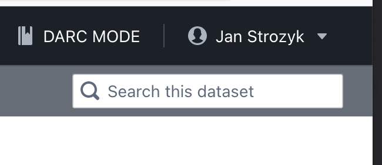
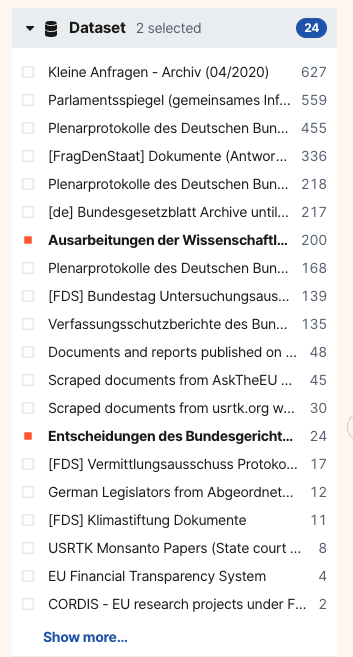
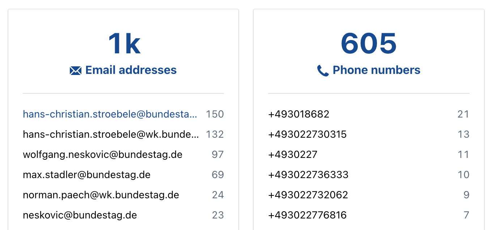

# Navigating Within Datasets

OpenAleph allows you to search within a specific dataset or investigation workspace. This scoped searching is useful when you want to focus your queries and avoid unrelated results.

## How to Search Within a Dataset

There are two primary ways to restrict your search to a specific dataset:

### 1. From the Dataset Page

{style="width:400px; margin:auto; display:block"}

1. Open the dataset from the **Datasets** tab.
2. Use the search bar within the dataset view. This automatically scopes your search to that dataset.

### 2. Using Filters

{style="width:300px; margin:auto; display:block"}

On a general search results page:

- Use the **Collection** filter in the left sidebar.
- Select the dataset(s) you want to search within.
- All search terms will now apply only to the selected dataset.

## Extracted `mentions` search

{style="width:600px; margin:auto; display:block"}

OpenAleph extracts several identifiers from the dataset during ingestion. You can click these identifiers on the overview page to see all entities or files containing them within the dataset.

## Source documents

{style="width:600px; margin:auto; display:block"}

If the dataset contains documents and folders, you can browse these sources by clicking the source documents tab, similar to browsing folder structures on your computer.

---

Scoped searching helps you stay focused on what matters most in your investigation. Combine it with [Advanced Search](advanced-search.md) techniques to zero in on exactly what you need.
