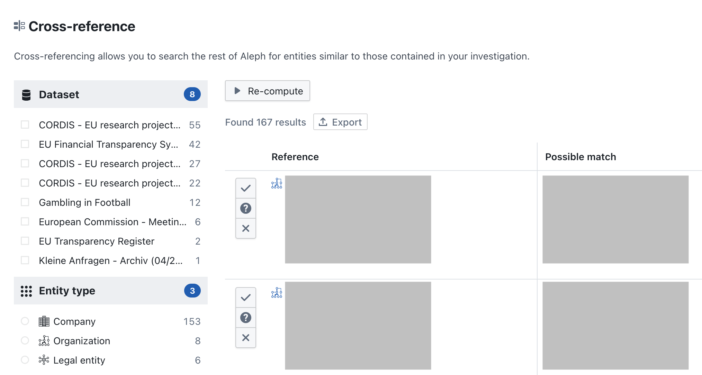

# Cross-Referencing Data

Cross-referencing allows you to compare the entities and documents in your private investigation workspace with public datasets and other investigations in OpenAleph. This is a powerful feature for uncovering overlaps, verifying information, or discovering unexpected connections.

## What is Cross-Referencing?

When you upload your own documents or create entities in an investigation workspace, OpenAleph can automatically check for matches with existing data in the system—like sanctioned individuals, leaked documents, or official registries.

This comparison is done at the entity level and is based on identifiers like names, email addresses, company numbers, or other structured properties.

## How to Cross-Reference

Cross-referencing happens automatically behind the scenes as your data is processed, but you can explore the results interactively:

1. Open your **Investigation**.
2. Navigate to the **Cross-reference** section in the sidebar.
3. Click `compute` if you haven't done that yet. Depending on the size of your OpenAleph instance, it will take a while before the results are shown.
4. Compare the entities that the cross-reference algorithm has found and confirm or reject them. You can also filter your restults with the side bar.

## Benefits of Cross-Referencing

- Quickly surface overlaps with known data sources
- Strengthen findings with third-party confirmation
- Identify new angles for your investigation

## Tips

- The more structured your data, the better the matching. Use mapping and normalization where possible.
- Matches are suggestive, not definitive, always verify manually.
- Combine cross-reference findings with network diagrams or lists to organize leads.

---

With cross-referencing, your investigation becomes part of a larger ecosystem of connected information. Use it to expand the scope and credibility of your findings.
