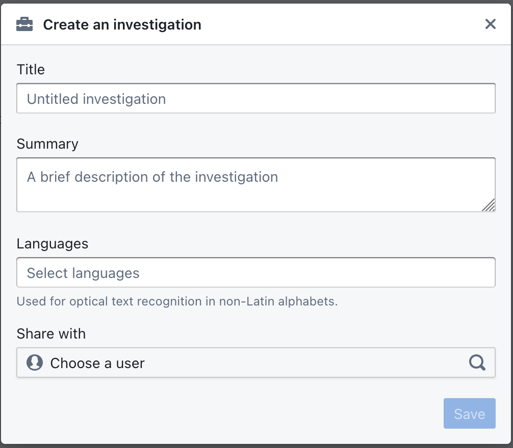

# Investigations

Investigations in OpenAleph provide a secure, private environment for uploading, organizing, and analyzing your own documents and data. These workspaces are ideal for managing internal investigations, collaborative research, or deep dives into specific topics.

## What is an Investigation?

An investigations is a user-created project area where you can:

- Upload documents and datasets
- Extract and review entities
- Bookmark and annotate content
- Visualize relationships between entities
- Share and collaborate with team members

Each workspace is isolated from public collections and is visible only to the users you invite.

## Creating a New Investigation

To create an investigation:

1. Click on **Investigations** in the top menu.
2. Click **Create a new investigation**.
3. Enter a name and optional description.
4. Choose whether to make it private (simply by selecting no other user) or invite collaborators.
5. Select the primary languages of your documents
6. Click **Create**.

 **Selecting the correct languages will impact the quality of the so-called OCR process, or optical character recognition.** This process is used by OpenAleph in the backend to make images or PDF searchable by extracting the text. Please make sure you select the right language here if possible, you can also change this option later in the investigation settings.

## Uploading Content

Once your workspace is created, you can upload:

- PDFs, spreadsheets, emails, and other document formats
- Structured datasets (CSV, Excel files)
- Bulk document archives (ZIP files)

OpenAleph will automatically index, parse, and attempt to extract text and entities from uploaded content.

**We do not recommend uploading large collections via your browser. Use the OpenAleph command line tool for that.**

## Investigation Tools

Within an investigation, you can:

- Perform full-text searches scoped to that investigation
- Use filters to explore documents and entities
- Begin building network diagrams or timelines

## Use Cases

Investigations are useful for:

- Analyzing leaks or large data dumps
- Conducting due diligence or background research
- Collaborating on investigative journalism projects
- Building structured case files over time

---

Next: Learn how to [Map Data](map-data.md) from tables into entities.
