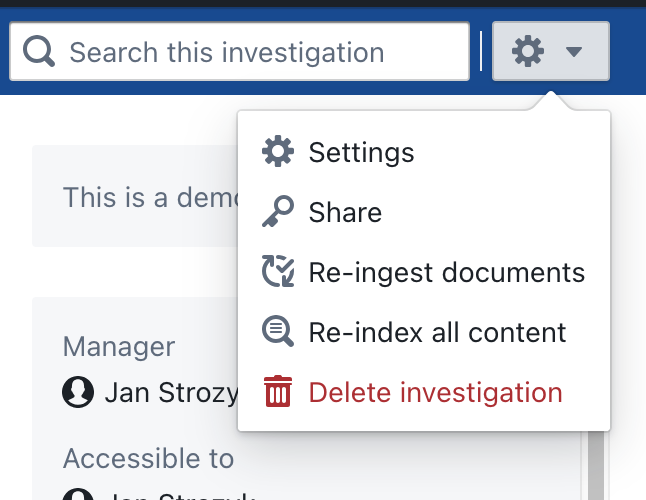
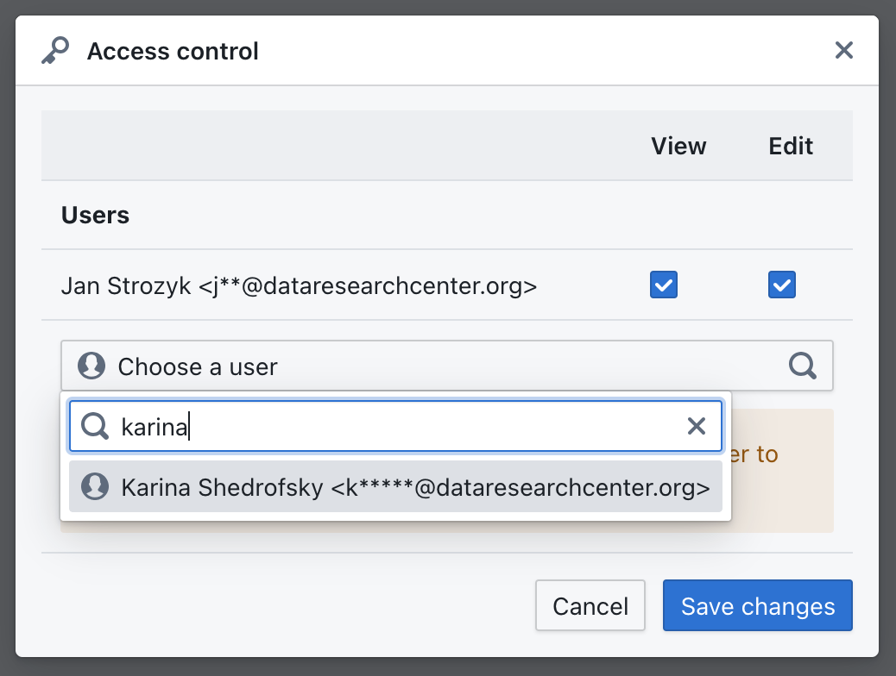

# Managing Access

Investigation workspaces in OpenAleph are private by default, but you can choose to share them with trusted collaborators. Managing access allows you to control who can view or contribute to a workspace without compromising sensitive information.

  

    <iframe src="https://www.youtube-nocookie.com/embed/T6V3jHxD6Ig?si=QnZ4HTv-rMspGgv9" frameborder="0" allowfullscreen
      style="position:absolute;top:0;left:0;width:100%;height:100%;"></iframe>
  

## Default Privacy

When you create a new workspace, it is only visible to you. No one else can see or interact with its contents unless you explicitly invite them.

## Sharing a Workspace

To share a workspace with others:

1. Open the workspace.
2. Click the **Gear icon** in the top right corner and select **Share** from the dropdown menu.

  

4. Enter the email address or username of the person you want to invite.

  

5. Assign a role:
	- **View**: Can see content, but cannot make changes.
	- **Edit**: Can upload documents, edit metadata, contribute to the investigation and add other users.

6. Click **Save changes**.

Invited users will see the workspace listed under their **Investigations** tab.

## Managing Existing Permissions

You can update or remove collaborators at any time by following the same steps listed above. Simply deselect the assigned roles and click **Save changes**.

## Best Practices

- Use the **Editor** role only for active collaborators.
- Periodically review access to investigations for ongoing projects.
- Avoid inviting users who don’t need access to sensitive data.

---

Proper access management ensures your investigation remains secure while allowing effective collaboration. Next, learn how to [Cross-Reference](cross-reference.md) your data with existing datasets in OpenAleph.
