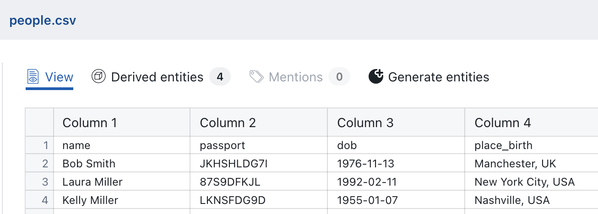
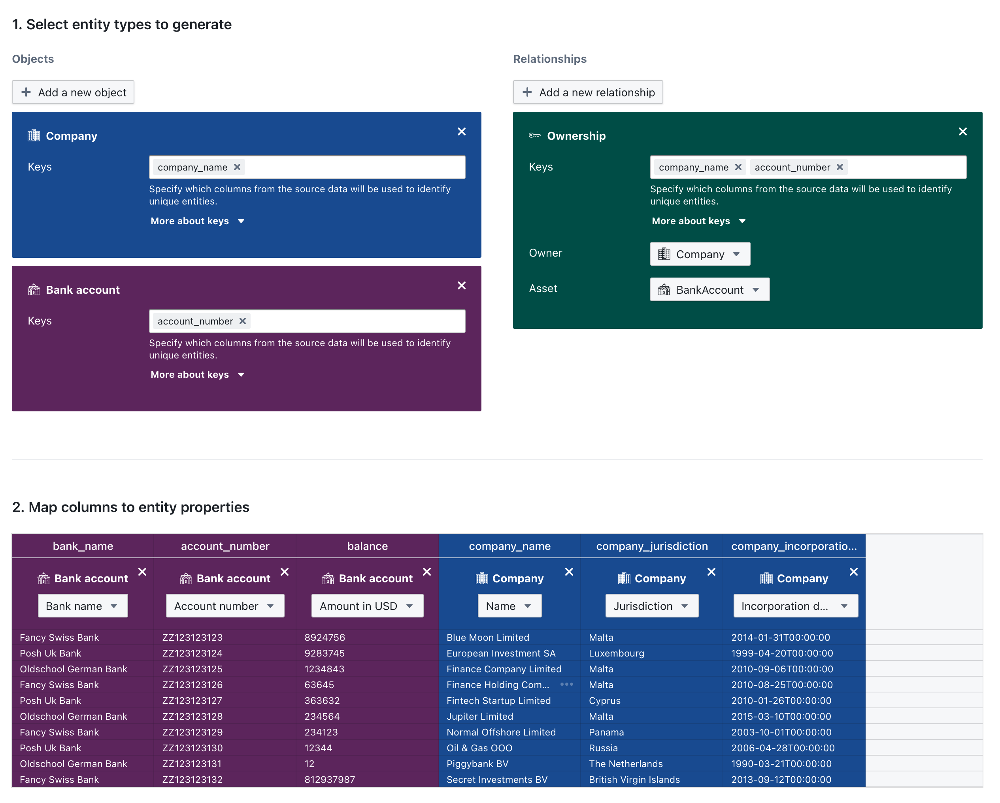

# Mapping Data

Mapping is the process of transforming rows of tabular data - such as CSV or Excel files — into structured entities within OpenAleph. This allows you to work with the data using the full power of OpenAleph’s search, visualization, and linking tools.

## What is Data Mapping?

When you upload a spreadsheet or other structured file into a workspace, OpenAleph can interpret each row as an entity. You define how the columns in your file correspond to entity properties such as name, address, jurisdiction, or identifier.

This is especially useful for:

- Turning registry exports into structured company records
- Extracting people or organizations from spreadsheets
- Normalizing disparate datasets for cross-referencing
- Working with multiple spreadsheets that contain information on an overlapping group of entities, such as people or companies

## How to Map a File

1. Upload a CSV or Excel file to your investigation workspace.
2. After upload, click the **Generate Entities** option.

3. In section 1, choose the target schema (e.g. `LegalEntity`, `Person`, `Asset`). [Here](https://followthemoney.tech/explorer/#schemata) is a list of all schemata the FtM data model supports. You may create more than one entity type from a single file. Remember that, in the OpenAleph logic, connections are entities too - so create these here as well.
4. In section 2, use the interface to assign each column in your file to a schema property.
5. Review and confirm the mapping. in section 3.
6. OpenAleph will then create new entities from the mapped rows.

This is what a simple mapping looks like that turns a table with bank accounts, some properties and ownership information into entities.

## Tips for Effective Mapping

- Make sure your data has consistent headers and formatting.
- Choose the schema that best matches the type of data you're importing.
- Map as many relevant columns as possible—this improves entity quality and discoverability.
- Use preview mode to verify your mappings before saving.

## After Mapping

Once mapping is complete:

- The newly created entities are available within your investigation after a few minutes.
- You can search for them, include them in network diagrams, and cross-reference them with public datasets.
- Each mapped entity is traceable back to the original source file.
- You can download the mapping and share the file with collagues - please note that it will only work with the same table headers. This is also useful if you have data that you update occassionally, but that stays in the same format. Just keep a mapping file that you can run again and again.

---

Mapping helps transform raw spreadsheets into usable, structured intelligence. Next, you’ll learn how to visualize those entities using [Network Diagrams](network-diagrams.md).
