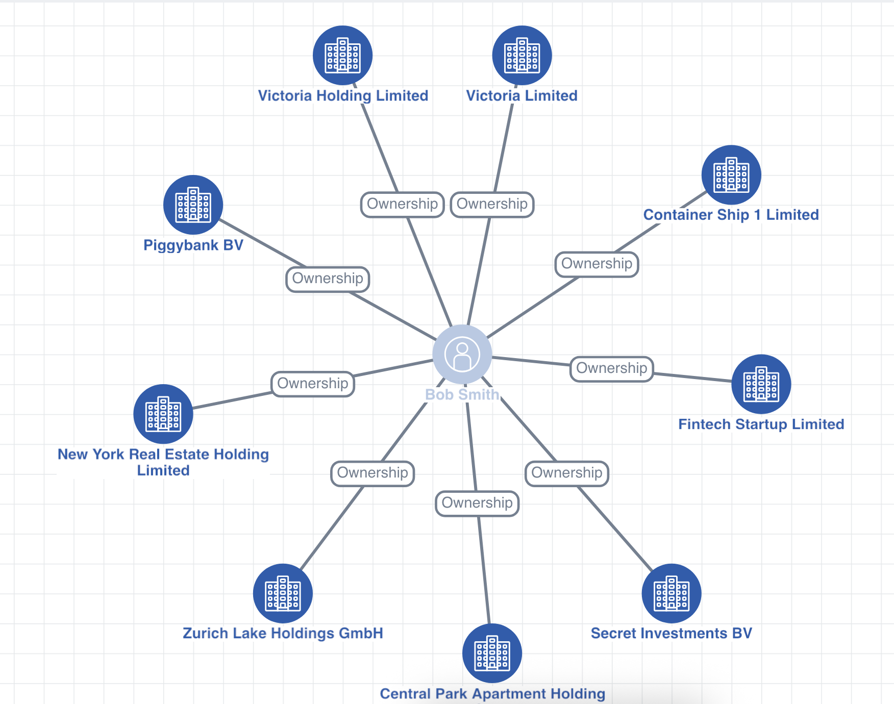

# Network Diagrams

Network diagrams in OpenAleph let you visually explore relationships between entities. These diagrams help surface connections that may not be obvious in raw data or text, making them valuable tools for analysis and storytelling.

## What Are Network Diagrams?

Network diagrams are interactive graphs that show entities (such as people, companies, or assets) as nodes, and their relationships (like ownership or affiliation) as edges between them.

They are generated directly from structured data within an investigation workspace.

## Creating a Diagram

1. Go to your **Investigation**.
2. Select **Network Diagrams** from the sidebar.
3. Click **New Diagram**.

4. Add entities from your investigation

5. Expand each entities with a double click, then select `Discover asset and shares`

6. Repeat step 6 with the newly discovered entities, if you want.
7. Additionally, you can create new entities in the diagram directly. They will be available in your investigation afterwards.

## Using the Diagram

Once generated, you can:

- Zoom and pan to explore large graphs
- Click a node to view details about the entity in the side bar
- Rearrange nodes and pick colors to make patterns clearer
- Export the diagram as an image or share it with collaborators

## Practical Use Cases

- Uncover hidden ownership links between companies
- Visualize shell structures and nominee relationships
- Map the flow of assets or influence
- Present investigation findings clearly

## Notes and Limitations

- Diagrams are based on the data you’ve uploaded or linked, so if relationships are missing, they won’t appear.
- Large datasets may result in very complex diagrams; filtering before generation can improve clarity.

---

Network diagrams turn structured data into visual insights. To further strengthen your investigation, see how to [Manage Access](manage-access.md) or [Cross-Reference](cross-reference.md) your findings with public datasets.
