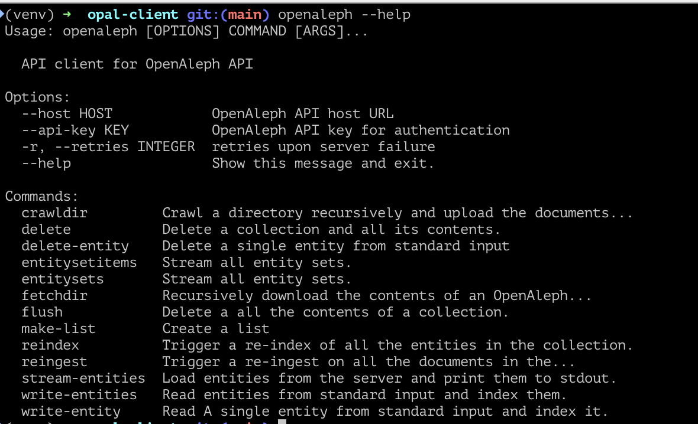

# Installation Guide

To use the OpenAleph CLI and Python library, you'll need to install the `openaleph` package.

## Prerequisites

- Python 3.6 or higher
- pip (Python package installer)

We recommend that you use a [virtual environment](https://packaging.python.org/en/latest/guides/installing-using-pip-and-virtual-environments/#create-and-use-virtual-environments).

## Installation Steps

1. **Install the package**:

	```bash
	pip install openaleph
	```

2. **Verify the installation**:

	```bash
	openaleph --help
	```

	This command should display the help information for the OpenAleph CLI.



You're now ready to use the OpenAleph CLI and Python library.

3. **Optional: Add environmet variables**

	The `openaleph` cli uses environment variables to read the host of the OpenAleph instance you want to interact with, as well as the API key.

	Store this information in your shells rc file or export it before you use `openaleph`

	```bash
	export OPAL_API_KEY=your_api_key
	export OPAL_HOST=https://your-aleph-instance.org
	```

	Alternatively, you can pass these values on the fly using the `--host` and `--api-key` options.

Move to the [next chapter](cli.md) to learn how `openaleph` is used from the command line.
